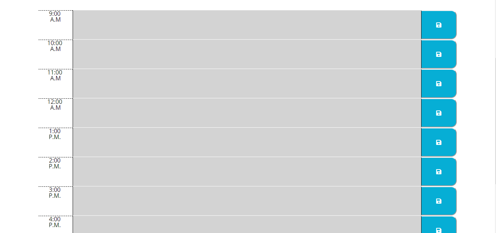

# third_party_apis_Homework_5

## Function 
From the top of the landing page you will see the current date, promoted by the Moment API. Directly beneath are nine rows with the date, a text area, and a save button (generated by font awesome). 

Select inside the textarea and type a reminder for that hour, or upcoming hour. Once you press the corresponding save icon, that line is saved in local storage. You can update the items or removing them entirely by editing the textarea and clicking the save icon. 

The rows will change color from red = present time, grey = past time, or green = future. This will update automatically through your computers time. 

## Intended Use

The intended use for this project is for the working professional looking to keep track of that days tasks. 

## Credit
Used font awesome for the save icon.
https://fontawesome.com/license

## Link to Deployed Product

https://mnorthup2207.github.io/third_party_apis_Homework_5/